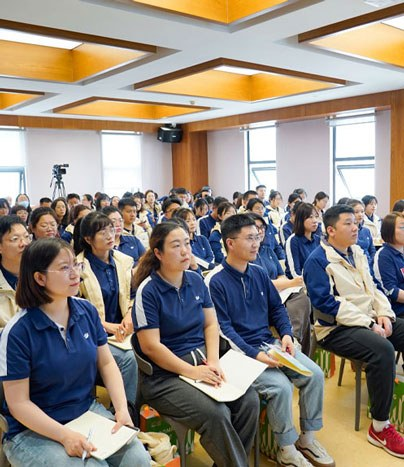
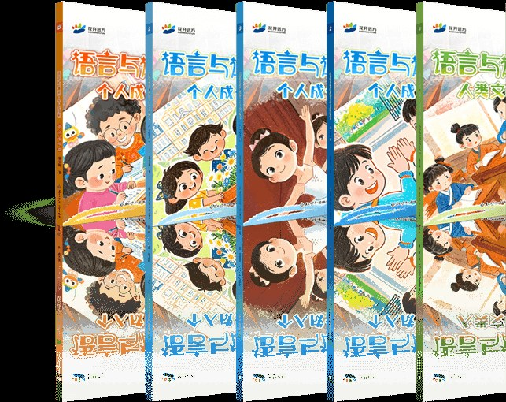

# Blooming Future v2.0 AI 视觉升级方案

> 状态：待批准，不含生产代码改动
>
> 调研日期：2026-07-22
>
> 约束：真实素材、原 Logo、小 A 吉祥物、Vanilla HTML/CSS/JS、无 npm/CDN/build tool

## 1. 结论先行

这次不做“加一点科技蓝光”的表面改版，而是把全站叙事改成一条可见的证据链：

**26 年真实华文教育积累 → 教材与课堂 → AI 学习方法 → 全球连接。**

视觉上采用“编辑部式双语排版 + 实景证据 + 可交互知识网络”。AI 感主要由数据关系、运行状态、语义节点和克制的动态产生，不使用 AI 生成宣传照片，也不伪造产品界面。

版本建议定为 **v2.0**。原因是本轮会同时重构首屏、内容节奏、真实素材层、AI 教育表达和移动端动效，不再是局部样式修补。

## 2. 当前页面深度审计

### 2.1 基线数据

| 项目 | 当前值 | 判断 |
|---|---:|---|
| 桌面页面高度，1440×900 | 9,427 px | 信息完整，但段落节奏偏长 |
| 移动页面高度，390×844 | 16,051 px | 连续阅读负担较高 |
| `index.html` | 30,010 bytes / 488 行 | 低于 80 KB 红线 |
| `main.css` | 25,835 bytes / 1,595 行 | 可继续原生维护 |
| `main.js` | 11,514 bytes / 327 行 | 粒子逻辑集中，适合原地重写 |
| 图片总量 | 约 1.3 MB | 体量可控，需继续 lazy-load |
| 横向溢出 | 桌面 0 / 移动 0 | 必须保持 |

### 2.2 已经做对的部分

1. 品牌五色、字体和中英并列已有稳定系统。
2. 首屏已有 Canvas 四层粒子，技术底座不需要推翻。
3. 商务部、ISO、教材、课堂、楼宇和小 A 素材已在仓库内。
4. 九个十分钟已具备 3×3 信息结构。
5. 纯静态技术栈性能基础好，升级无需引入依赖。

### 2.3 主要问题

| 优先级 | 问题 | 视觉后果 | 本轮处理 |
|---|---|---|---|
| P0 | Hero token 穿过标题与正文 | AI 感变成噪声，品牌可读性下降 | 设置内容避让区、降低密度、重做层级 |
| P0 | 真实教材与校区图片尚未进入页面 | “26 年经验”主要靠文字陈述 | 建立真实教育证据带 |
| P0 | Singapore section 仍占一个大型主场景 | 与“弱化新加坡、天津为实景主体”冲突 | 压缩为全球连接横带 |
| P1 | 移动端仍持续高频 RAF | 看似降级，实际未真正限帧 | 30fps 节流、离屏/失焦暂停 |
| P1 | About / AI / Philosophy 连续大段文字 | 页面长且缺少扫描锚点 | 时间轴、图像、短标签分担信息 |
| P1 | 低清证书被当作大图入口 | 放大会暴露清晰度不足 | 原生尺寸证据窗 + 文字事实 |
| P2 | Contact 三栏权重接近 | 天津总部主次不突出 | 天津主栏、新加坡辅栏、部门横条 |
| P2 | Reveal 只有统一淡入 | 全站动态节奏单一 | 分层时序，但保持克制 |

## 3. GitHub 方案调研与取舍

所有项目只作为模式参考，不安装、不复制依赖代码。

| 参考项目 | 借鉴点 | 不采用的部分 | 落地方式 |
|---|---|---|---|
| [tsParticles](https://github.com/tsparticles/tsparticles) | `fpsLimit`、失焦暂停、离开视口暂停、Retina 上限、responsive 与 reduced motion | 包体、npm/CDN、配置层复杂度 | 在现有 Canvas 中实现约 50 行生命周期控制 |
| [particles.js](https://github.com/VincentGarreau/particles.js) | 按画布面积控制密度、近距离连线、pointer repulse | 项目较旧、单纯粒子审美 | 保留密度公式与邻域连接思路，改成语义 token |
| [Pts](https://github.com/williamngan/pts) | update/draw 分离、Canvas space、pointer 作为场景参与者 | 约百 KB 库与额外抽象 | `updateScene()` / `drawScene()` 两阶段原生实现 |
| [AOS](https://github.com/michalsnik/aos) | 一次性 reveal、offset、duration、移动端差异化 | 依赖与 transform 可能造成横向溢出 | 继续使用现有 IntersectionObserver，只扩展三种节奏 |
| [web-vitals](https://github.com/GoogleChrome/web-vitals) | LCP、CLS、INP 的验收定义 | 线上采集 SDK 与追踪 | 仅在本地验收时读取 Performance API |
| [Lighthouse CI](https://github.com/GoogleChrome/lighthouse-ci) | 性能预算和静态站检查思路 | npm、CI 包安装 | 用仓库脚本 + 浏览器实测执行同类预算 |
| [W3C WCAG](https://github.com/w3c/wcag) | 动画可暂停、reduced motion、可读性 | 无 | OS 减少动态时只渲染静态首帧，动画不启动 |
| [claude-design-skill](https://github.com/jiji262/claude-design-skill) | asset-first、事实核验、anti-slop 设计纪律 | 通用模板、React/Babel 示例 | 先固定真实品牌素材，再设计信息与动效 |
| [Page UI](https://github.com/danmindru/page-ui) | 响应式组件的完整状态与一致间距 | React/Tailwind、SaaS 卡片墙审美 | 只借鉴组件状态纪律，拒绝套用产品落地页皮肤 |

### 3.1 核心决策

1. **不引入粒子库。** 现有需求只有几十个语义粒子，原生 Canvas 更小、更可控。
2. **AI 感来自关系，不来自数量。** 少量 token、连接、运行状态比满屏字符更可信。
3. **真实图片承担“证据”，Canvas 承担“未来”。** 两类视觉各司其职，不把照片加工成伪科技图。
4. **动画必须知道何时停。** 页面离屏、标签页失焦、系统 reduced motion 都要停止 RAF。
5. **拒绝通用 AI SaaS 模板。** 本站是有 26 年历史的教育机构，不采用巨型渐变标题、玻璃卡片墙、假 dashboard 截图或紫蓝光球。

## 4. 目标信息架构

保留现有 6 个锚点和导航，不新增路由。

```text
Nav
└─ 01 Hero：品牌 + AI 知识网络 + 一句话定位
└─ 02 About：26 年时间轴 + 天津真实教育现场 + 数字 + 资质
└─ 03 AI Education：AI 学习过程可视化 + 四项能力 + 教材 + 九个十分钟
└─ 04 Singapore：一条轻量全球连接横带，无实景图
└─ 05 Philosophy：创始理念 + 小 A「大象无形」收尾
└─ 06 Contact：天津主联系 + 新加坡辅联系 + 部门入口
Footer
```

目标不是机械删字，而是把现在 9,427 / 16,051 px 的页面压缩约 12% 至 18%，让每屏都出现一个新的视觉证据或交互反馈。

## 5. 真实素材板与使用规则

以下均为当前仓库中由 `far1999.com` 抓取的素材，不生成替代图。

| 天津楼宇 | 课堂空间 | 教学现场 | 官方教材 |
|---|---|---|---|
|  |  |  |  |

| 商务部资质 | ISO 9001 | 小 A 吉祥物 |
|---|---|---|
|  |  |  |

### 5.1 素材映射

| 文件 | 尺寸 | 页面位置 | 显示策略 |
|---|---:|---|---|
| `campus-3.jpg` | 480×276 | About 天津总部主证据 | 最大显示约 560 px，不做全屏背景 |
| `campus-2.jpg` | 480×276 | About 课堂辅助图 | 16:9，保持原图文字可见 |
| `campus-1.jpg` | 404×467 | About 教学现场竖图 | 4:5 裁切，人物不裁头 |
| `textbook-1..5.jpg` | 584-643 px 宽为主 | AI Education 教材轨道 | 5 张 lazy-load，桌面错位陈列，移动端横向滑动 |
| `cert-mofcom.png` | 308×251 | About 资质证据窗 | 接近原生尺寸，点击不伪装高清 |
| `cert-iso9001.png` | 308×437 | About 资质证据窗 | 等高缩略图，事实文字在旁 |
| `mascot-elephant.png` | 450×400 | Philosophy 底部 | 显示 80×80 至 96×96 |
| `bloomingfuture-logo.png` | 3543×3543 | Nav | 继续使用，不改图形、不换文件 |

### 5.2 禁止项

1. 不使用 AI 生成照片、虚构教室、虚构新加坡总部或虚构证书。
2. 不把 308 px 证书放大成大幅背景。
3. 不给实景图加“AI 扫描线”等会改变证据属性的特效。
4. Singapore section 不放任何天津照片冒充当地场景。

## 6. 逐屏视觉设计

### 6.1 Nav

**构图：** 当前 Logo 左、导航中、CTA 右的结构不变。透明态只保留 1 px 底线；滚动后切到高对比背景。

**升级点：**

- Logo 使用当前 `bloomingfuture-logo.png`，不执行高清替换任务。
- 桌面导航高度固定，滚动前后不产生布局跳动。
- 移动菜单打开后锁定背景滚动，焦点可回到 burger。
- CTA 文案与目标仍为 `#contact`，不假装已有在线报名系统。

### 6.2 Hero：Humanities Intelligence Field

```text
┌──────────────────────────────────────────────────────────────┐
│ Logo / Nav                                  Enrol            │
│                                                              │
│ 中文人文教育 · SINCE 1999                  [语义网络集中区] │
│ 花开远方                                     token ─ model   │
│ Blooming Future                        文 ─ embedding ─ 读   │
│                                                              │
│ 26 年真实教学，正在成为每个孩子的 AI 学习系统。              │
│ bilingual supporting copy                      status 01/06 │
└──────────────────────────────────────────────────────────────┘
```

**内容层：** 品牌名仍是首屏最大信号；副文案从“机构历史介绍”收紧为“26 年教学如何进入 AI 时代”。详细历史移到 About。

**Canvas 层：**

| 层 | 元素 | 数量/尺寸 | 行为 |
|---|---|---|---|
| Ambient | 汉字 `文/学/读/写/思/诗...` | 桌面 28-36，14-18 px | 低速上浮，opacity 0.08-0.13 |
| Tokens | `LLM/NLP/token/model/embedding...` | 桌面 8-10，22-30 px | 五色随机，4-7 秒单点脉冲 |
| Code | 6 条既有 mock snippet | 桌面 3-4，14 px mono | 仅从右侧与底边进出 |
| Links | 相邻语义点连接 | 同时最多 2 组 | 700-900ms 淡出，不穿过文字区 |
| Pointer | 120 px 影响半径 | 桌面 | 缓慢排斥并拉动最近连接，不追踪移动端 |

**可读性保护：** Hero 主文案外扩 32 px 形成 exclusion zone。大 token 与连线不能进入；底层汉字进入时 opacity 再降 50%。

**性能生命周期：**

- DPR `Math.min(devicePixelRatio, 2)`。
- 桌面 60fps 上限，移动 30fps 上限。
- `document.hidden` 或 Hero 完全离开视口时暂停。
- `ResizeObserver` 只在尺寸实际变化后重新 seed。
- `prefers-reduced-motion: reduce` 时绘制一张静态网络后退出，不启动 RAF。

### 6.3 About：真实积累不是口号

顶部保留双语标题，正文缩成两段。随后出现一条 4 节点时间轴：

`1999 天津创立 → 2015 探索 AI 教育 → 2023 新加坡运营节点 → NOW 26 年课程进入智能学习`

**真实教育现场：** 采用 7/5 不对称编辑网格。左侧楼宇与地址事实，右侧课堂、教学现场上下组合。图片直接显示，不套多层卡片。

**统计：** 四个数字改成一条有基线的等宽数据带；数字 count-up 只执行一次。

**资质：** 两张真实证书放在窄证据窗，旁侧写发证/备案事实；目前没有图片的两项继续以文字列出，明确不伪造图章。

### 6.4 AI Education：把“AI”变成可理解过程

新增一个代码原生的 **AI Learning Loop**，它不是假产品截图，而是教育流程图：

```text
[真实教材页] → 识别知识点 → 生成启发式问题 → 学生表达 → 教师反馈
  language       embedding       reasoning        response      insight
```

每 2 秒推进一步，使用 transform/opacity；文字始终可见，动画只改变 active 状态。reduced motion 下全部步骤静态并列。

四个 AI 能力卡继续保留，但改成 2×2 工作面板：统一高度、编号左上、关键词状态右上，减少现在的大面积空白。

**教材轨道：** `textbook-1..5.jpg` 作为课程真实来源，桌面五张形成层次但不重叠标题；移动端使用原生横向 scroll-snap，不自动轮播。

### 6.5 九个十分钟

桌面严格 3×3，按红/橙/绿三行。每张卡顶部 4 px accent，编号使用 mono。

升级不改变九项内容，只改善扫描效率：

- 桌面卡高固定，标题与描述基线对齐。
- hover/focus 时只有 2 px 上移和边线增强，不改变卡片尺寸。
- 移动端改成紧凑纵向卡：编号左，双语内容右；九张总高度控制在约 1,100 px。
- 三行色序保留，不制造九种新色。

### 6.6 Singapore：辅助全球节点

由当前 1,047 px 高的大 section 压缩成 420-560 px 的全宽横带。

```text
03 / Singapore      2023 · Global operating node
从天津连接世界       一段双语说明
                     [五个等权 tag，单行或均匀换行]
```

删除大型事实卡的视觉重量，但保留其真实主体信息。无实景图。五个 tag 桌面单行，窄屏通过 `flex: 1 1 ...` 让每一行均匀填满。

### 6.7 Philosophy：安静收束

创始人引语保留，但缩短大字号占屏高度。正文由三块压为两列，突出“渊博、坦荡、快乐”。

小 A 放在 section 最底部独立 banner：上下各 64 px，顶底 1 px `var(--line)`，图像 80-96 px，文字居中。无漂浮动画，避免把品牌哲学做成娱乐化角色区。

### 6.8 Contact：天津为主，新加坡为辅

桌面改为 8/4 两栏：

- 天津主栏包含 `campus-3.jpg`、地址、`+86 022-5918-5201`、`400-000-6909`。
- 地址保持“天津市津南区·启迪科技园 35 号楼”。
- 新加坡辅栏只保留地址、电话、邮箱、网站与营业时间，不放图片。
- Departments 变成两栏下方的全宽细行，不再与两个 HQ 争夺同等卡片权重。

移动端顺序：天津 → 新加坡 → Departments。

## 7. 全站动效编排

| 场景 | 触发 | 时长 | 约束 |
|---|---|---:|---|
| Hero 网络 | 页面可见且 Hero 在视口 | 持续 | 生命周期受控，见 6.2 |
| Section header | 首次进入视口 | 480 ms | translateY ≤16 px |
| 正文/图片 | header 后 80 ms | 520 ms | 不从屏幕外大距离飞入 |
| 数据 count-up | 50% 可见 | 1,200 ms | 只运行一次 |
| AI Learning Loop | 60% 可见 | 8-10 s/轮 | 离屏暂停，不抢焦点 |
| 教材 | 首次进入视口 | 依次 60 ms | reduced motion 同时显示 |
| Hover | pointer 设备 | 160-220 ms | 只用 transform/opacity/border |

全站不使用自动横向跑马灯、背景视频、滚动劫持、3D、WebGL 或持续抖动。

## 8. 响应式规则

| 断点 | 网格 | 关键变化 |
|---|---|---|
| ≥1100 px | 12 列 | Hero 两个视觉区、About 7/5、Contact 8/4 |
| 768-1099 px | 8 列 | 图片仍保持双列，产品卡 2×2 |
| <768 px | 4 列 | 单栏叙事、30fps、关闭 Code/Links/Pointer |
| <480 px | 4 列 | 精简 Hero 粒子、ritual 紧凑行、教材横滑 |

稳定性要求：任何断点都不得横向溢出；按钮、卡片和固定格式区域有明确 `min/max/aspect-ratio`；长英文实体名可以自然换行。

## 9. 性能与可访问性预算

| 项目 | 目标 | 验证 |
|---|---:|---|
| 首屏 HTML | <80 KB | `wc -c index.html` |
| CSS | <40 KB | `wc -c assets/css/main.css` |
| JS | <20 KB | `wc -c assets/js/main.js` |
| 外部网络请求 | 0 | 浏览器 network 汇总 |
| Canvas DPR | ≤2 | canvas/client 尺寸比 |
| 桌面动画 | 60fps 目标 | 10 秒 RAF 采样 |
| 移动动画 | 30fps 上限 | 时间戳节流断言 |
| CLS | <0.05 | 本地 PerformanceObserver + 视觉复核 |
| LCP | <2.5s on 4G | 部署后浏览器节流复核 |
| 横向溢出 | 0 px | 390/768/1440 三视口 |

可访问性：语义 heading 顺序不跳级；所有真实图片有具体 alt；Canvas 保持 `aria-hidden`；键盘可操作 Nav；颜色不是唯一的信息载体；系统 reduced motion 下没有持续动画。

## 10. 验收矩阵

### 10.1 自动检查

1. 所有 `img src` 均为 `/assets/img/` 本地路径，文件存在。
2. HTML 不出现外部 CDN、analytics、framework 或 module loader。
3. 品牌五色和字体 token 未变。
4. 联系方式和天津地址精确匹配 source markdown。
5. Hero 具备 DPR cap、visibility、IntersectionObserver、ResizeObserver 与 30fps 分支。
6. `content/*.md` 与对应 section 文案同步日期更新。
7. `verify.sh` 全部通过后才允许完成任务。

### 10.2 浏览器检查

| 视口 | 必查项 |
|---|---|
| 1440×900 | Hero 可读、Canvas 非空、图片构图、3×3 ritual、Singapore 降权 |
| 1024×768 | 网格不拥挤、证书不放大、产品卡等高 |
| 768×1024 | Nav 与双列切换正确、图片无裁头 |
| 390×844 | 无横溢、30fps 分支、教材可滑、Contact 顺序正确 |

另外检查：首屏 10 秒无 console error；所有 lazy image 滚入后 `naturalWidth > 0`；Canvas 不覆盖主文案；页面隐藏后动画计数停止；reduced motion 为静态画面。

## 11. 实施顺序与提交边界

| 顺序 | 可见结果 | 预计 AI 协作耗时 | 建议 commit |
|---:|---|---:|---|
| 1 | 验收脚本先锁定红线 | 30 min | `chore: add v2 visual acceptance tests` |
| 2 | 首屏 AI 知识网络可用 | 45 min | `feat: build responsive AI knowledge field` |
| 3 | 天津、课堂、教材真实证据进入页面 | 45 min | `feat: surface real education evidence` |
| 4 | AI Learning Loop 与九项课程完成 | 50 min | `feat: visualize the AI learning system` |
| 5 | Singapore/Philosophy/Contact 权重重排 | 40 min | `style: rebalance global and headquarters sections` |
| 6 | 移动端、性能、无障碍收口 | 45 min | `fix: close responsive motion and accessibility gaps` |
| 7 | 全视口 QA、文档、部署 | 30 min | `docs: record v2 visual verification` |

估算：**传统设计与前端团队约 4-6 个工作日；AI 协作约 4-6 小时**，不含用户审批和 Cloudflare 发布等待。

## 12. 风险与回滚

| 风险 | 预防 | 回滚 |
|---|---|---|
| 动画再次干扰标题 | exclusion zone + 截图检查 | 单独回退 Hero commit |
| 低清图被过度放大 | 设最大显示宽度 | 隐藏图窗，保留事实文字 |
| 页面仍过长 | 每个 section 设目标高度 | 回退局部间距，不删核心文案 |
| 移动端 CPU 偏高 | 30fps、关闭 3/4 层、离屏暂停 | 移动端静态首帧 |
| 文案与 markdown 不一致 | 自动检查同步标记 | 阻断 verify，不提交 |
| 上线回归 | 每任务独立 commit | `git revert <commit>`，不 force push |

## 13. 明确不做

- 不更换 Logo，不继续寻找高清 Logo。
- 不生成新加坡总部照片，不把天津照片用于新加坡。
- 不尝试“修复”证书内容或 AI 超分辨率重绘文字。
- 不增加报名表、登录、CMS、后台或真实 AI 推理服务。
- 不引入 React/Vue/Three.js/tsParticles/AOS/npm/CDN。
- 不改品牌五色、字体、双语并列和既有联系信息。

## 14. 批准后交付物

1. 更新后的 `index.html`、`assets/css/main.css`、`assets/js/main.js`。
2. 同步后的 `content/*.md`。
3. 无依赖验收脚本与 `.loopwork/hooks/verify.sh`。
4. 1440、1024、768、390 四档截图与浏览器检查记录。
5. 每项任务独立 commit、最终 hash 清单、部署结果和回滚点。
